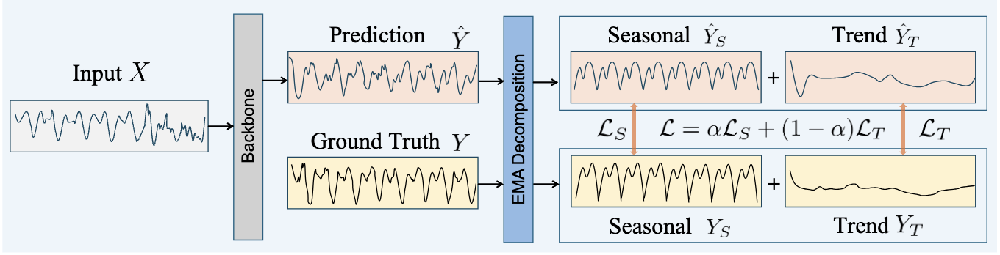
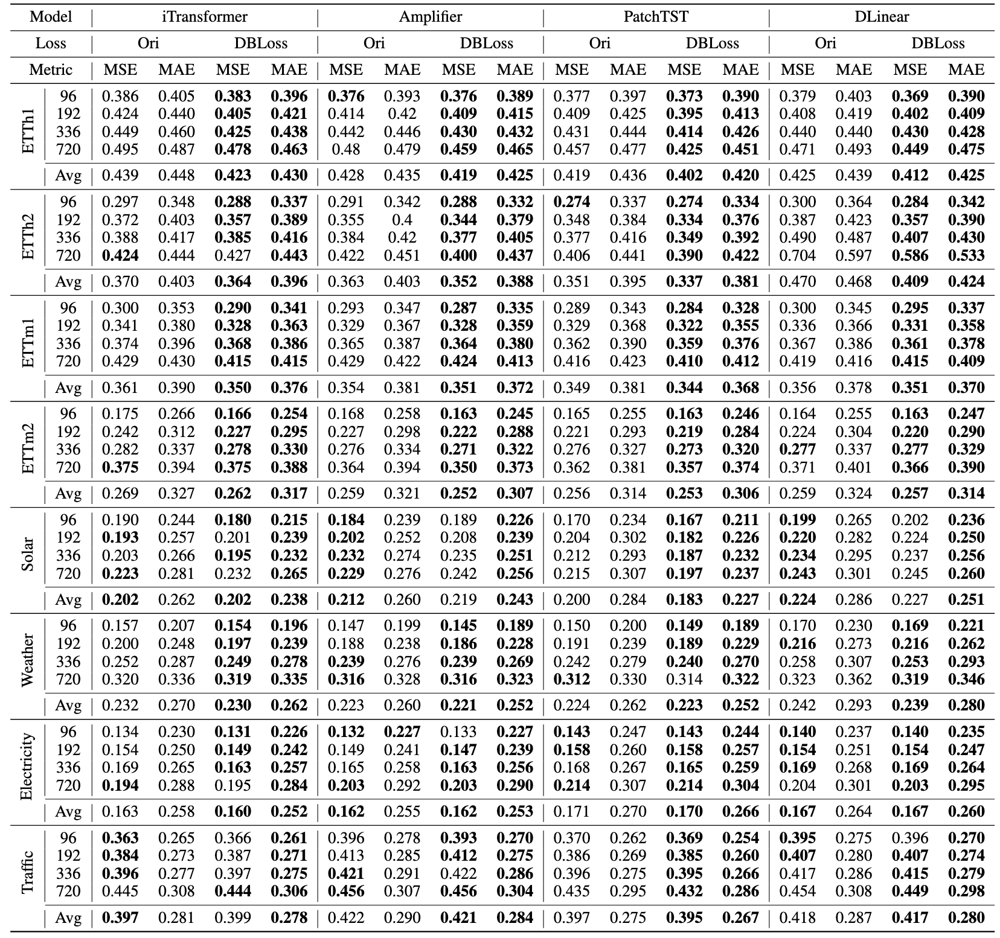

# DBLoss: Decomposition-based Loss Function for Time Series Forecasting

**This code is the official PyTorch implementation of our NIPS'25 paper: [DBLoss: Decomposition-based Loss Function for Time Series Forecasting]().**

[](https://arxiv.org/pdf/2510.14510)  [](https://www.python.org/)  [](https://pytorch.org/)   

If you find this project helpful, please don't forget to give it a ⭐ Star to show your support. Thank you!

## Introduction

<div align="center">

</div>

Time series forecasting holds significant value in various domains such as economics, traffic, energy, and AIOps, as accurate predictions facilitate informed decision-making. However, the existing Mean Squared Error (MSE) loss function sometimes fails to accurately capture the seasonality or trend within the forecasting horizon, even when decomposition modules are used in the forward process to model the trend and seasonality separately. To address these challenges, we propose a simple yet effective **D**ecomposition-**B**ased **Loss** function called **DBLoss**. This method uses exponential moving averages to decompose the time series into seasonal and trend components within the forecasting horizon, and then calculates the loss for each of these components separately, followed by weighting them. As a general loss function, DBLoss can be combined with any deep learning forecasting model. Extensive experiments demonstrate that DBLoss significantly improves the performance of state-of-the-art models across diverse real-world datasets and provides a new perspective on the design of time series loss functions.


## Quickstart
> [!IMPORTANT]
> this project is fully tested under python 3.8, it is recommended that you set the Python version to 3.8.
1. Installation:

> ```shell
> pip install -r requirements-docker.txt
> ```

2. Data preparation:

You can obtained the well pre-processed datasets from [Google Drive](https://drive.google.com/file/d/1vgpOmAygokoUt235piWKUjfwao6KwLv7/view?usp=drive_link). Then place the downloaded data under the folder `./dataset`. 

3. Train and evaluate model:

- To see the model structure of DBLoss, [click here](https://github.com/qiu69/DBLoss/blob/main/ts_benchmark/baselines/utils.py).

- We provide the experiment scripts for all benchmarks under the folder `./scripts/multivariate_forecast`. For example you can reproduce a experiment result as the following:

```shell
sh ./scripts/multivariate_forecast/ETTh1_script/DLinear.sh
```


## Results

Long-term multivariate forecasting results. The table reports MSE and MAE for different forecasting horizons F ∈ {96, 192, 336, 720}. The parameters for the baselines are kept consistent with those of [TFB](https://github.com/decisionintelligence/TFB). The better results are highlighted in bold.

<div align="center">

</div>


## Citation

If you find this repo useful, please cite our paper.

```

@inproceedings{qiu2025DBLoss,
title     = {DBLoss: Decomposition-based Loss Function for Time Series Forecasting},
author    = {Xiangfei Qiu and Xingjian Wu and Hanyin Cheng and Xvyuan Liu and Chenjuan Guo and Jilin Hu and Bin Yang},
booktitle = {NeurIPS},
year      = {2025}
}
```


## Contact

If you have any questions or suggestions, feel free to contact:

- [Xiangfei Qiu](https://qiu69.github.io/) ([xfqiu@stu.ecnu.edu.cn](mailto:xfqiu@stu.ecnu.edu.cn))

- [Xingjian Wu](https://ccloud0525.github.io/) ([xjwu@stu.ecnu.edu.cn](mailto:xjwu@stu.ecnu.edu.cn))

Or describe it in Issues.
